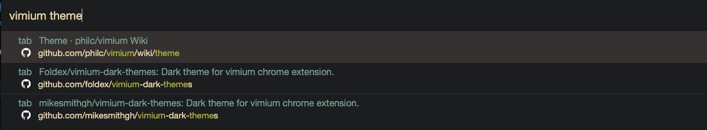
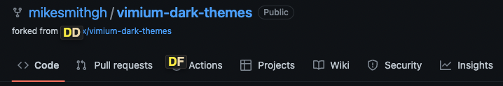

# vimium-dark

!!! This was hacked together, I need to come back and clean it up. !!!

Dark themes for vimium chrome/firefox extension.

Double fork! Forked [vimium-simply-dark](https://github.com/Foldex/vimium-simply-dark) from Forked from [vimium-simply-dark](https://github.com/ysjn/vimium-simply-dark)

## Usage
In Vimium Options: `Show Advanced Options` then paste into `CSS for Vimium UI`
Uncomment theme of choice to enable.

## Screenshots

### Guvbox Dark

